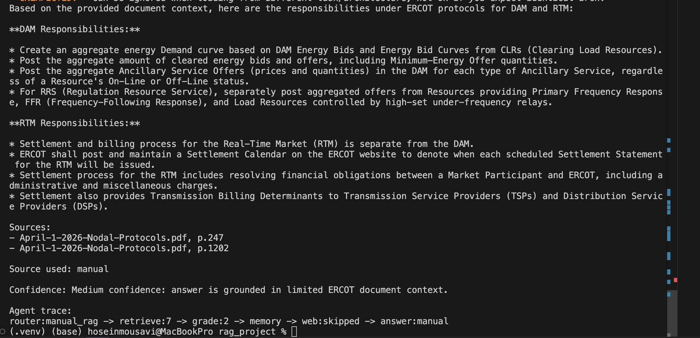

# ERCOT Multi-Agent RAG System

A local multi-agent Retrieval-Augmented Generation (RAG) system built with LangGraph to answer questions over ERCOT market documents such as Nodal Protocols, Operating Guides, and Market Guides.

## Features

- Multi-agent workflow with LangGraph
- Local PDF ingestion with Chroma vector store
- ERCOT-specific query expansion and reranking
- Source citations and confidence notes
- Optional Tavily web fallback
- Agent trace for debugging and demos
- Local memory with SQLite checkpoints

## Demo

Example query output with source citations, confidence note, and agent trace:



## Architecture

The workflow uses six agents:

1. Router Agent
2. Retrieval Agent
3. Grading Agent
4. Memory Agent
5. Web Fallback Agent
6. Answer Agent

## Required Data

Create a `data/` folder and place these ERCOT PDFs inside it:

- `April-1-2026-Nodal-Protocols.pdf`
- `February-1-2026-Nodal-Operating-Guide.pdf`
- `February-1-2026-Commercial-Operations-Market-Guide.pdf`
- `February-1-2026-Planning-Guide.pdf`

## Setup

Create and activate a virtual environment:

```bash
python3 -m venv .venv
source .venv/bin/activate
```
## Quick Start

### Ingest ERCOT documents

```bash
python multi_agent_rag_local_Ercot.py ingest --data-dir data
```
# Ask a question

```bash
python multi_agent_rag_local_Ercot.py ask \
  --query "What are the DAM and RTM responsibilities under ERCOT protocols?" \
  --thread-id demo \
  --show-trace
```
# Start interactive chat

```bash
python multi_agent_rag_local_Ercot.py chat --show-trace
```
